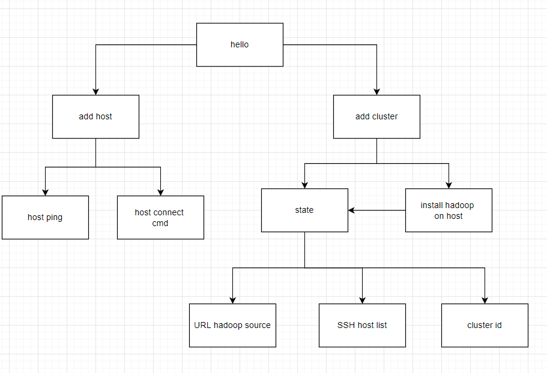

# ClusterManager

Cluster Manager - приложение, которое может подключаться к машинам по ssh, и устанавливать кластер Hadoop

Архитекутра 

# install 
yum install python
pip3 install -r requirements
pip install fastapi
pip3 install starlette uvicorn